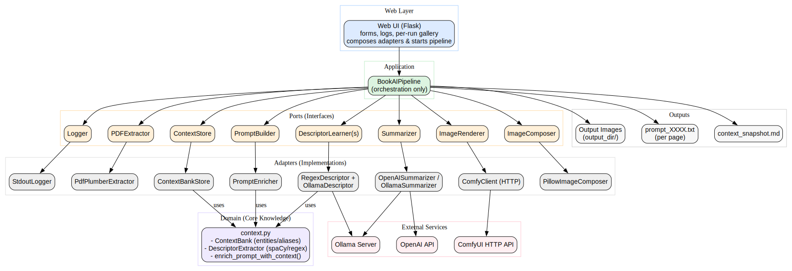

# BookAI – Architecture & Workflow (by Andrew)

This document explains the full structure of the BookAI project. It is written as a detailed guide with per-file explanations, the coding style, the folder purposes, and how everything integrates together.

---

## Philosophy

The goal was to build BookAI with **clarity, modularity, and extensibility**. That means:

- Classes and files do **one job well**.  
- All external dependencies (like pdfplumber, OpenAI, ComfyUI, Pillow) are wrapped in **adapters**.  
- The main orchestration code (`BookAIPipeline`) depends on **interfaces (ports)**, not libraries.  
- The web interface (`bookai/web`) is just a thin layer to start runs and serve results.  

This makes the project **readable, testable, and adaptable**.

---

## Folder Structure

```
bookai/
├─ config.py
├─ domain/
│  └─ context.py
├─ ports/
│  ├─ logger.py
│  ├─ pdf_extractor.py
│  ├─ context_store.py
│  ├─ descriptor_learner.py
│  ├─ summarizer.py
│  ├─ prompt_builder.py
│  ├─ image_renderer.py
│  └─ gallery_repo.py
├─ adapters/
│  ├─ stdout_logger.py
│  ├─ pdfplumber_extractor.py
│  ├─ context_bank_store.py
│  ├─ regex_descriptor_learner.py
│  ├─ ollama_descriptor_learner.py
│  ├─ openai_summarizer.py
│  ├─ ollama_summarizer.py
│  ├─ prompt_enricher.py
│  ├─ comfy_client.py
│  ├─ pillow_image_renderer.py
│  └─ ollama_api.py
├─ application/
│  └─ pipeline.py
└─ web/
   ├─ app.py
   ├─ templates/
   │  └─ index.html
   └─ static/
      ├─ style.css
      └─ app.js
```

---

## File-by-File Explanations

### `bookai/config.py`
- **Purpose**: Store and load configuration.  
- `Config` dataclass holds all options (input PDF path, output dir, OpenAI key, etc.).  
- `ConfigManager` loads/saves JSON at `~/.config/bookai/config.json`.  
- Helpers:
  - `ensure_dir(path)` → safely create directories.  
  - `parse_pages_spec("1-3,5", total_pages)` → expand into `[1,2,3,5]`.  

---

### `bookai/domain/context.py`
- **Purpose**: Handle persistent knowledge of characters and descriptors.  
- `ContextBank`: JSON-backed storage of entities with `upsert()`, deduplication, alias merging, and regex matching.  
- `DescriptorExtractor`: uses spaCy (if installed) or regex fallback to find physical descriptors (hair, eyes, clothing).  
- `enrich_prompt_with_context()`: adds a snippet of known entities to a prompt.  

This is the **knowledge brain** of BookAI.

---

### `bookai/ports/*`
These define **interfaces (contracts)** used by the pipeline.

- `logger.py`: interface for logging.  
- `pdf_extractor.py`: interface for extracting text from PDFs.  
- `context_store.py`: interface for persisting descriptors/entities.  
- `descriptor_learner.py`: interface for extracting descriptors.  
- `summarizer.py`: interface for summarizing text.  
- `prompt_builder.py`: interface for combining summaries with context.  
- `image_renderer.py`: interface for generating and optionally composing images.  
- `gallery_repo.py`: interface for listing images for the gallery.

These ports mean the pipeline doesn’t know or care **how** a service works.

---

### `bookai/adapters/stdout_logger.py`
- Implements `Logger`.  
- Prints logs to stdout and optionally calls a callback (so the web UI can capture logs).

### `bookai/adapters/pdfplumber_extractor.py`
- Implements `PDFExtractor`.  
- Uses `pdfplumber` to read PDF pages.  
- Throws a clear error if `pdfplumber` isn’t installed.

### `bookai/adapters/context_bank_store.py`
- Wraps `ContextBank` to implement `ContextStore`.  
- Adds a helper to export a Markdown snapshot of the known context.

### `bookai/adapters/regex_descriptor_learner.py`
- Implements `DescriptorLearner`.  
- Uses the domain `DescriptorExtractor` to find descriptors with regex/spaCy.

### `bookai/adapters/ollama_descriptor_learner.py`
- Implements `DescriptorLearner`.  
- Uses `ollama_api.ollama_extract_descriptors()` to call a local Ollama server.

### `bookai/adapters/openai_summarizer.py`
- Implements `Summarizer`.  
- Calls OpenAI API for summaries.  
- Returns empty string on failure.

### `bookai/adapters/ollama_summarizer.py`
- Implements `Summarizer`.  
- Uses Ollama to generate prompts enriched with known context.

### `bookai/adapters/prompt_enricher.py`
- Implements `PromptBuilder`.  
- Wraps `enrich_prompt_with_context`.

### `bookai/adapters/comfy_client.py`
- Implements `ImageRenderer`.  
- Injects prompt into ComfyUI workflow JSON.  
- Sets deterministic seed per page.  
- Queues run, polls for output, downloads result.  

### `bookai/adapters/pillow_image_renderer.py`
- Wraps Pillow.  
- Adds captions beneath images.  
- If Pillow is missing, throws clear error.

### `bookai/adapters/ollama_api.py`
- Pure helper functions for Ollama REST API:  
  - `ollama_extract_descriptors()`  
  - `list_models()`  
  - `ollama_generate_prompt()`  

---

### `bookai/application/pipeline.py`
- **Purpose**: Orchestrator.  
- Class `BookAIPipeline` runs the whole process:  
  1. Validate inputs.  
  2. Reset context if flagged.  
  3. Extract PDF pages.  
  4. Loop through each page:  
     - Learn descriptors.  
     - Update context.  
     - Summarize with OpenAI/Ollama/fallback.  
     - Enrich with context.  
     - Save prompt to file.  
     - Render with ComfyUI.  
     - Add caption if flagged.  
     - Save image.  
     - Log progress.  
  5. At the end, report success.

The pipeline **only imports ports and config**. No direct library calls.

---

### `bookai/web/app.py`
- **Purpose**: Flask web interface.  
- Routes:
  - `/`: render index.html.  
  - `/start`: start generation in a thread.  
  - `/logs`: return logs as JSON.  
  - `/outputs`: return this run’s generated files.  
  - `/all-outputs`: return all files in output folder.  
  - `/download/<file>`: serve an image.  

- Keeps in-memory run state: `LOGS`, `FILES`, `RUNNING`.  
- Builds adapters and runs the pipeline.

---

### `bookai/web/templates/index.html`
- HTML skeleton with:  
  - Sidebar navigation (Generate / Gallery).  
  - Generate tab: form for config, logs section, run gallery.  
  - Gallery tab: shows all files.  

### `bookai/web/static/style.css`
- Modern dark theme.  
- Slide-in/out sidebar with animation.  
- Card UI, responsive grid, logs styling.  
- Gallery styling with thumbnails.

### `bookai/web/static/app.js`
- Handles sidebar toggle & backdrop.  
- Switches views (Generate vs Gallery).  
- Polls `/logs` and `/outputs` while a run is active.  
- Loads gallery images.  

---

## Overall Workflow

1. User opens web UI → fills form → hits Generate.  
2. Flask saves config → builds adapters → spawns pipeline thread.  
3. Pipeline processes PDF → learns descriptors → builds prompt → renders images.  
4. Logs and new images stream to UI via polling.  
5. User sees gallery update live.  
6. Context snapshot is updated → used in future runs.  

---

## Coding Style

- **Classes do one thing**.  
- **Adapters thin**: only handle one library.  
- **Pipeline clean**: only orchestrates.  
- **Clear errors** if dependency missing.  
- **Config centralized**.  
- **Type hints everywhere**.  
- **Readable names**.  

---

## How Everything Fits Together

- **Domain**: context knowledge.  
- **Ports**: what the app *needs*.  
- **Adapters**: how we *get it*.  
- **Pipeline**: tells the story.  
- **Web**: thin UI.  

This structure makes BookAI easy to extend, test, and understand.

---


## Architecture Diagram

For a visual overview, refer to the diagram below.  
This diagram is stored in the project as `diagram.svg`.



The diagram shows how:

- **Web Layer** (Flask UI) triggers the pipeline.
- **Application Layer** (BookAIPipeline) only talks to **ports**.
- **Ports** are contracts/interfaces like PDFExtractor, Summarizer, ImageRenderer, etc.
- **Adapters** implement these ports with real libraries (pdfplumber, OpenAI, ComfyUI, Pillow, etc.).
- **Domain** holds core logic (ContextBank, DescriptorExtractor).
- **External Services** (OpenAI, Ollama, ComfyUI) are called only by adapters.
- **Outputs** (images, context snapshots, prompts) are saved for the gallery and debugging.

This diagram complements the per-file breakdown above and provides a big-picture map of the system.

---
